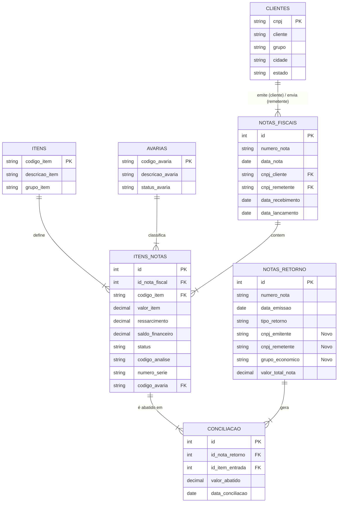

<div align="center">
  <h1>Partlog</h1>
  <p><strong>Sistema de Gestão de Garantias e Itens</strong></p>

  <p>
    Sistema desktop para controle completo do fluxo de garantias: <br>
    entrada → análise técnica → devolução/reparo/rejeição
  </p>

  <p>
    
    
    
    
  </p>

<p>
    <a href="#-sobre-o-projeto">Sobre</a> •
    <a href="#-tecnologias">Tecnologias</a> •
    <a href="#-instalação-e-execução">Instalação</a> •
    <a href="#-regras-de-negócio-implementadas">Regras de Negócio</a> •
    <a href="#-diagrama-do-banco-de-dados">Diagrama DB</a> •
    <a href="#-acesso-ao-banco-de-dados">Acesso DB</a>
  </p>
</div>

## 📖 Sobre o Projeto

**Partlog** é um sistema desktop desenvolvido para gerenciar todo o ciclo de vida de itens em garantia de forma organizada e eficiente.

Principais funcionalidades:
- Registro de entrada de produtos em garantia
- Análise técnica com registro de diagnóstico e solução
- Controle de status (em análise / aguardando peça / reparado / rejeitado / devolvido)
- Histórico completo por produto/cliente
- Relatórios básicos de desempenho da garantia

## 🛠 Tecnologias

- **Linguagem principal**: Python 3.10+
- **Interface gráfica**: PySide6 (Qt for Python)
- **Banco de dados**: PostgreSQL
- **Containerização do banco**: Docker + docker-compose
- **Padrão de arquitetura**: MVC simplificado + DTO

## ✅ Pré-requisitos

- Python 3.10 ou superior
- Docker Desktop (ou Docker + docker-compose no Linux)
- Git (recomendado)

## 🚀 Instalação e Execução

```bash
# 1. Clone o repositório
git clone https://github.com/1joaovfr/Partlog.git
cd partlog

# 2. Suba o container do Banco de Dados
# Isso criará um banco chamado 'cardex_db' na porta 5432
docker-compose up -d

# 3. Crie e ative o ambiente virtual
python -m venv .venv
source .venv/bin/activate    # Linux / macOS
# ou
.venv\Scripts\activate       # Windows

# 4. Instale as dependências
pip install -r requirements.txt

# 5. Execute a aplicação
python main.py
```

## 📂 Estrutura do Projeto

A arquitetura segue o padrão **MVC (Model-View-Controller)** com a utilização de **DTOs (Data Transfer Objects)** para garantir a integridade dos dados entre as camadas.

```plaintext
partlog/
├── controllers/       # Lógica de controle e orquestração entre UI e Banco
├── database/          # Configurações de conexão e sessão do PostgreSQL
├── dtos/              # Objetos de Transferência de Dados (Pydantic/Dataclasses)
├── models/            # Modelos ORM (Mapeamento das tabelas do banco)
├── styles/            # Arquivos de estilização visual (QSS/Temas)
├── views/             # Componentes da interface gráfica (PySide6)
├── docker-compose.yml # Definição dos containers (Banco de Dados)
├── main.py            # Ponto de entrada da aplicação
├── requirements.txt   # Dependências do projeto
└── seeder.py          # Script para popular o banco com dados iniciais
```

## 🧠 Regras de Negócio Implementadas

O sistema aplica regras estritas para garantir a integridade fiscal e financeira das garantias:

### 1. Rastreabilidade (Traceability)
* **Código de Análise Único:** No momento da entrada (`LancamentoModel`), o sistema gera automaticamente um código sequencial baseado no mês (Ex: `A0052`, onde 'A' representa Janeiro).
* **Conciliação Financeira:** O sistema impede que uma garantia seja paga em duplicidade. A tabela `itens_notas` possui um campo `saldo_financeiro`.
    * Ao lançar uma Nota de Retorno (`RetornoModel`), o valor é abatido desse saldo.
    * O item só é considerado "encerrado" quando o saldo chega a zero.

### 2. Fluxo de Análise Técnica
O fluxo segue o padrão **DAO (Data Access Object)** com injeção de SQL puro para performance:
1.  **Entrada:** Registro da NF do cliente e criação dos itens como `Pendente`.
2.  **Análise:** O técnico insere dados de engenharia (Nº Série, Código de Avaria) e define se é `Procedente` ou `Improcedente`.
3.  **Fechamento:** O sistema agrupa itens procedentes por cliente ou grupo econômico para gerar a NF de Retorno/Ressarcimento.

### 3. Inteligência de Dados (BI)
O módulo `DashboardModel` calcula KPIs em tempo real:
* **Gap de Recebimento:** Diferença média de dias entre a chegada física e o lançamento no sistema.
* **Análise de Safra:** Comparativo financeiro entre Entrada vs. Saída (Devolução) nos últimos 6 meses.

## 🗺️ Diagrama do Banco de Dados



## 🗄️ Acesso ao Banco de Dados

O projeto utiliza um container **PostgreSQL 16 Alpine**. Para conectar ferramentas de gerenciamento (DBeaver, pgAdmin, Datagrip), utilize as credenciais definidas no `docker-compose.yml`:

| Parâmetro | Valor Padrão |
| :--- | :--- |
| **Host** | `localhost` |
| **Porta** | `5432` |
| **Database** | `cardex_db` |
| **Usuário** | `dev` |
| **Senha** | `indisa` |

> **Nota:** Os dados persistem no volume `postgres_data`. Para resetar o banco completamente, execute `docker-compose down -v`.

## 🚧 Status do Projeto e Roadmap

O projeto encontra-se em fase de **desenvolvimento/testes**.

- [x] Estrutura MVC e Banco de Dados (Docker)
- [x] CRUD de Garantias e Produtos
- [ ] Implementação de autenticação robusta
- [ ] **Empacotamento (.exe):** Geração de executável para distribuição nas máquinas da empresa.
- [ ] **Ambiente de Produção:** Configuração de variáveis de ambiente (`.env`) para conexão segura com servidor PostgreSQL dedicado.

> **Nota:** Atualmente, as credenciais do banco estão fixadas no `docker-compose.yml` para facilitar o ambiente de desenvolvimento local.
